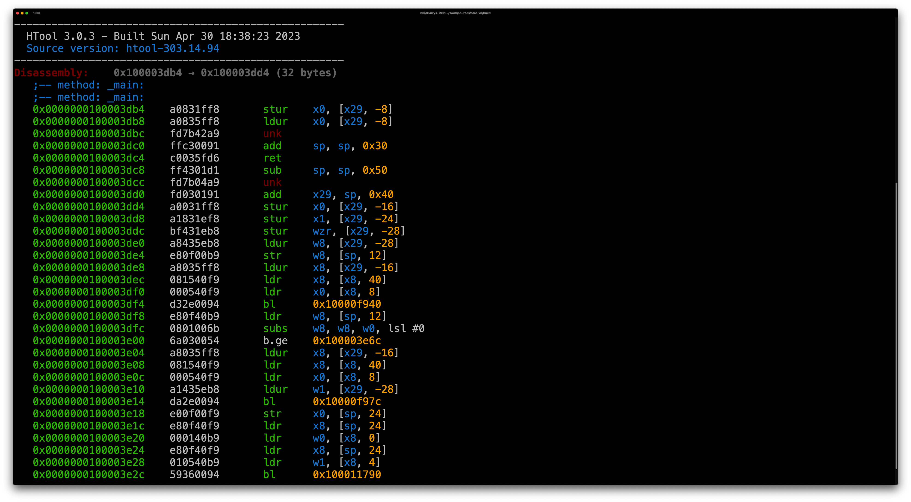

# Libarch: An ARM64 Disassembly Framework.

See the Releases page for downloads. The current `master` branch is `1.0.0`.

## Description

Libarch is a lightweight ARM64/AArch64 Disassembly Framework. It provides a library and (eventually) tools for reverse engineering binaries compiled for 64-bit ARM processors. The development of Libarch was primarily for my BSc Computer Science project HTool which used Libarch to provide disassembly of Mach-O binaries and iOS/macOS firmware files.

## Installation

Currently, you can add Libarch as a Git Submodule to your project, and include it via CMake. There may be support for installing Libarch via a package manager at some point, but this is the best way for now. If you want, you can develop your tool as part of this codebase under the `tools/` directory.

## Contributing

Contributions are welcome. To contribute code, fork the repository to make your changes and create a Pull Request. I will do my best to review and merge any changes as fast as possible. 

Code style and guidelines will be developed soon.

## Documentation

Official Libarch documentation will be produced and published at h3adsh0tzz.com, under the Libarch tab on the Projects page. 
